# SKILLFORGE v2 — Flow Diagrams (Mermaid)

Paste-ready Mermaid. GitHub renders these as visuals automatically.
Brainstorming set: review each flow, then we lock it before coding.

---

## 1. System overview — the 3 parts and how they talk

```mermaid
flowchart LR
    U[User browser] --> FE[Aurora Dark Frontend]

    subgraph P1 [Part 1 — Core · FastAPI monolith]
        API1[/api/v1]
        PORTS1[Inbound ports]
        DOM1[Domain core]
        OUT1[Outbound ports]
        API1 --> PORTS1 --> DOM1 --> OUT1
    end

    subgraph P2 [Part 2 — Code Engine · separate host]
        API2[Runner API]
        DOCK[Docker sandbox<br/>no network · CPU/RAM/time caps]
        API2 --> DOCK
    end

    subgraph P3 [Part 3 — Launchpad · monolith modules]
        BILL[Billing]
        RES[Resume]
        PORT[Portfolio]
        HIRE[Hiring prep]
    end

    FE --> API1
    OUT1 -->|CodeRunnerClient port| API2
    API1 --> BILL & RES & PORT & HIRE
    OUT1 --> DB[(Postgres)]
    OUT1 --> LLM[LLM provider<br/>budget-capped]
    PORT -->|GitHubPublisher port| GH[(User's GitHub<br/>repo + Pages)]
    BILL -->|PaymentGateway port| PAY[Razorpay / Stripe]

    style P2 fill:#1a0f0f,stroke:#f87171
```

> The red box is deliberate: Part 2 is the only part that touches untrusted
> code, so it lives on an isolated host. Everything else talks through ports.

---

## 2. Hexagonal anatomy — one feature, the full path

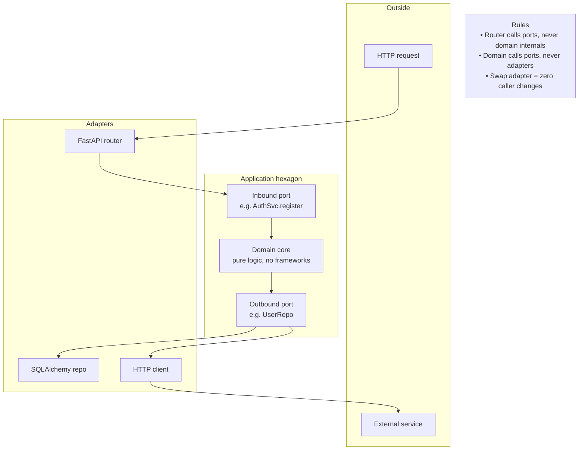

---

## 3. Request lifecycle — F1-001 Register (sequence)

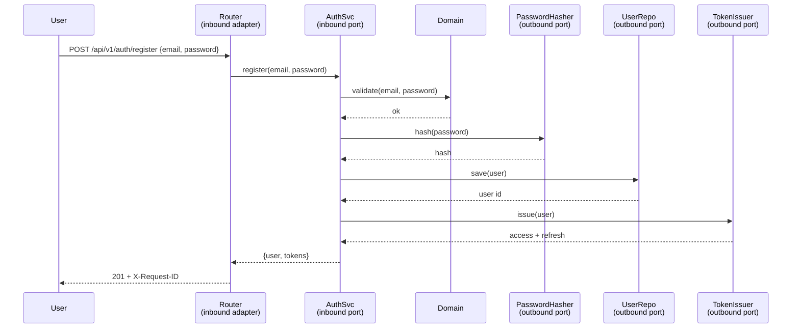

---

## 4. Auth flows — F1-002 login · F1-004 refresh · F1-003 logout

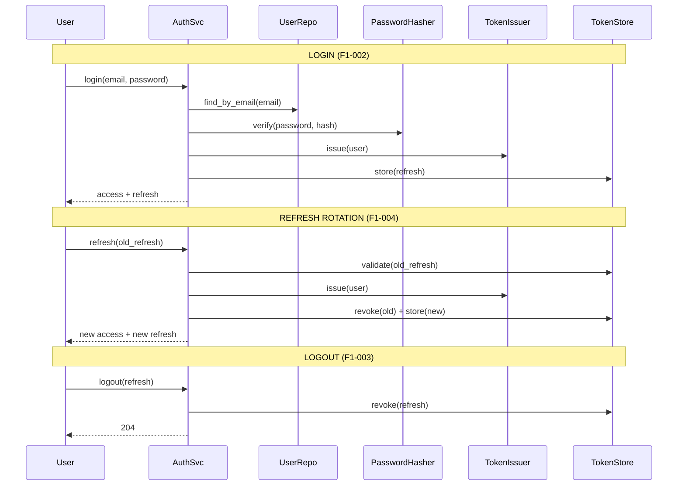

---

## 5. Assessment submit → scoring → verified evidence (F1-030 → F1-031/032 → F1-038)

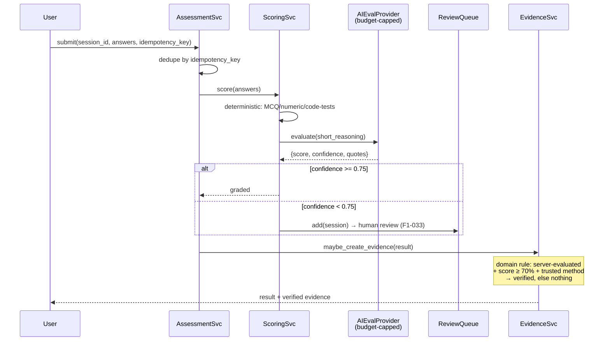

---

## 6. Placement / verification flow (F1-036)

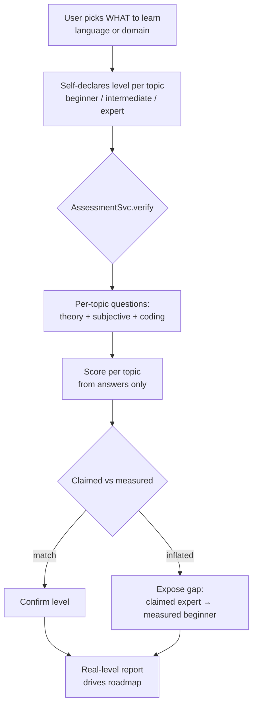

---

## 7. Code run — Core → Part 2 (F2-001 → F2-013)

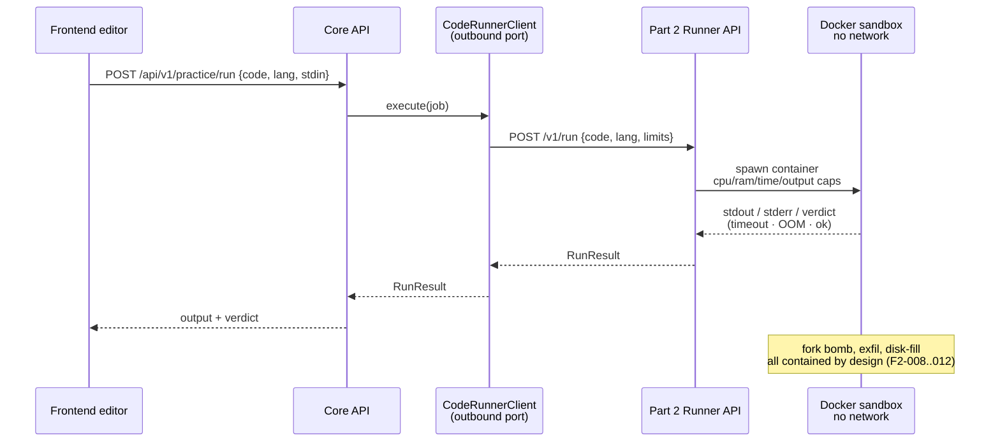

---

## 8. Plagiarism pipeline (F2-014 → F2-017)

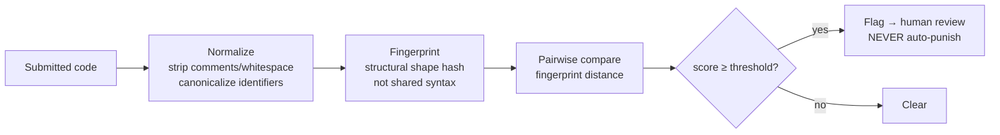

---

## 9. Checkout + webhook → entitlements (F3-002 → F3-004)

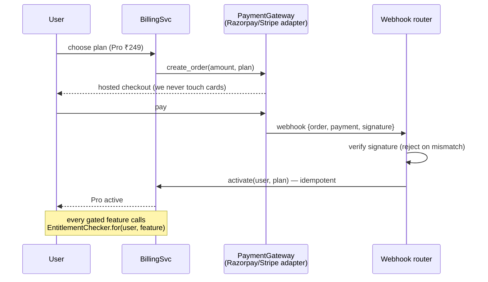

---

## 10. Portfolio publish to user's GitHub (F3-013)

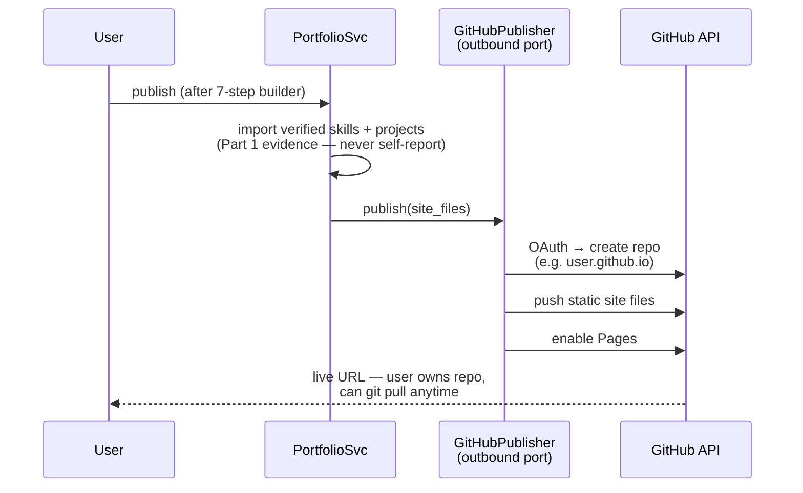

---

## 11. PI mock with camera + AI feedback (F3-020 → F3-023)

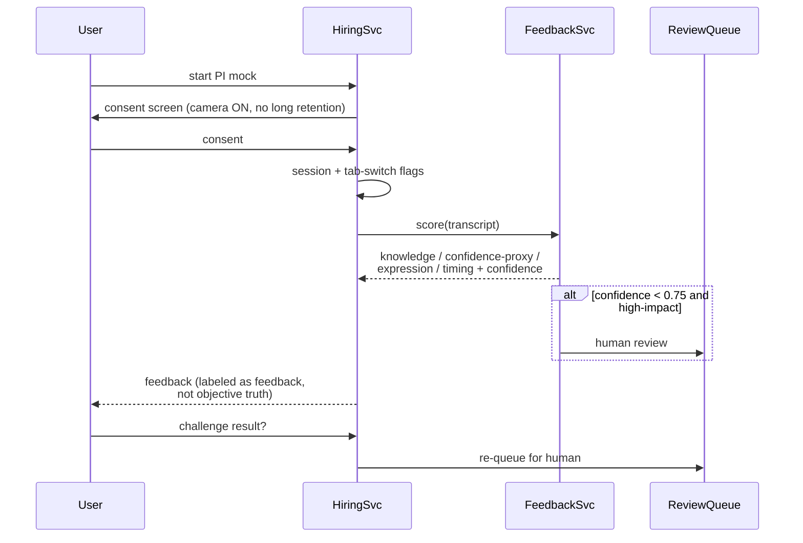

---

## 12. Feature mindmap — all 105 features at a glance

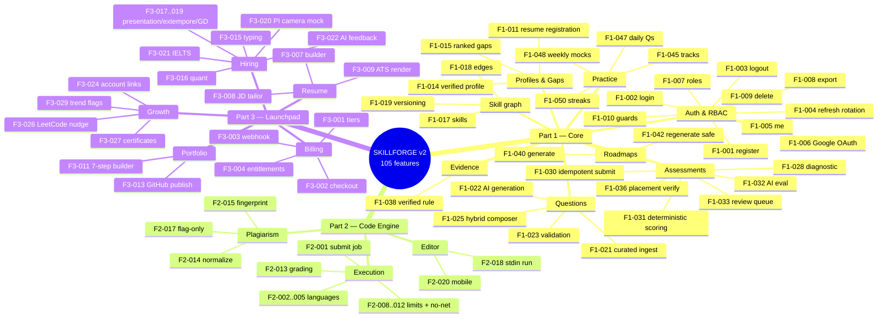

---

## How to use this for brainstorming

1. Read a diagram, trace the arrows, ask "what breaks if X fails?" — every
   answer becomes an edge case in `SPECS.md` and a test in `TESTING.md`.
2. Challenge each port: "could we swap this adapter?" — if not, the boundary
   is wrong.
3. When a flow is agreed, its phase in `FEATURE_INVENTORY.md` is locked and
   the PLAN gate opens.
